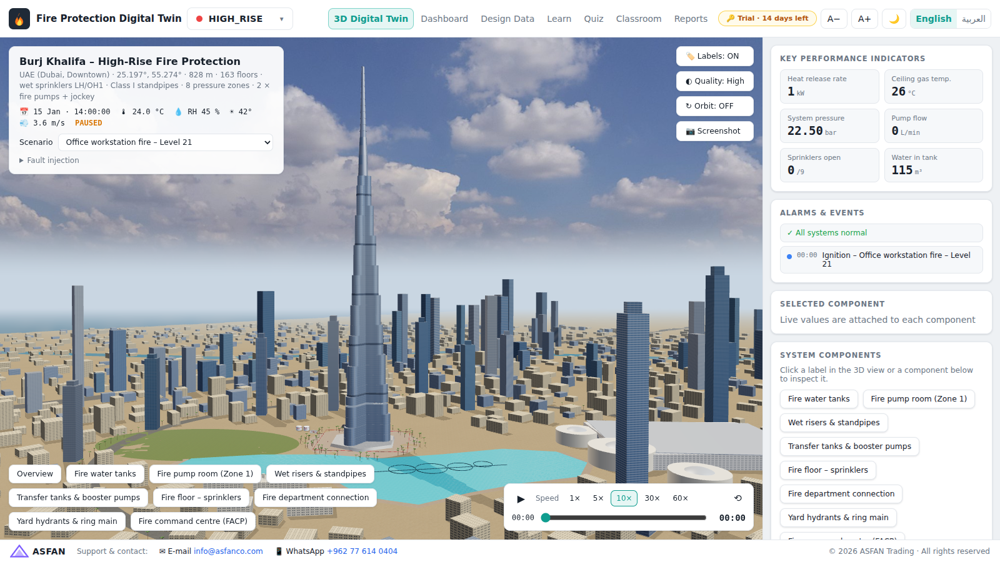
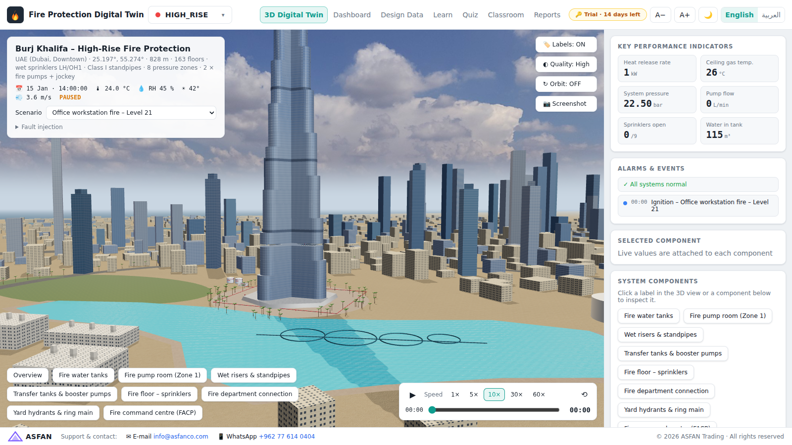
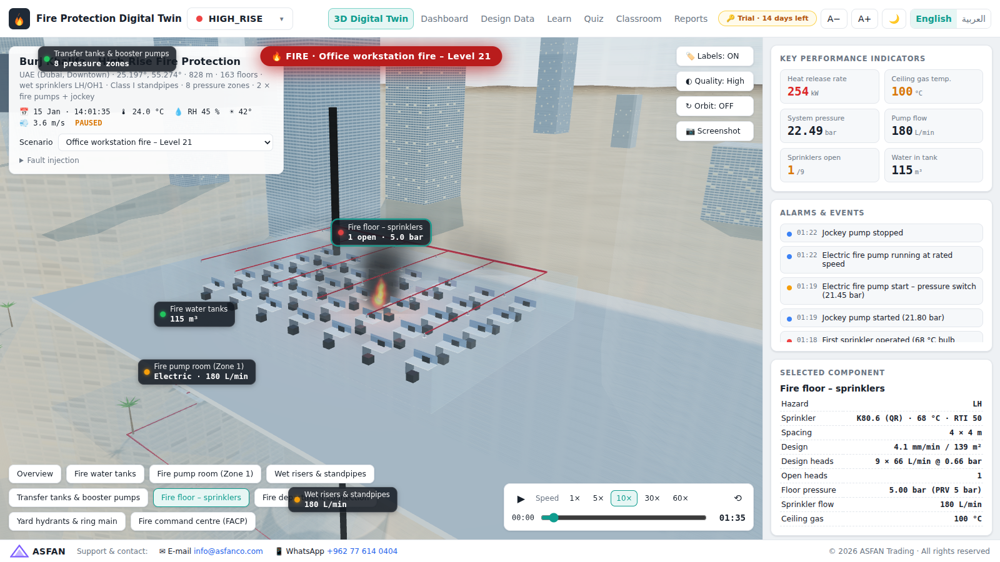
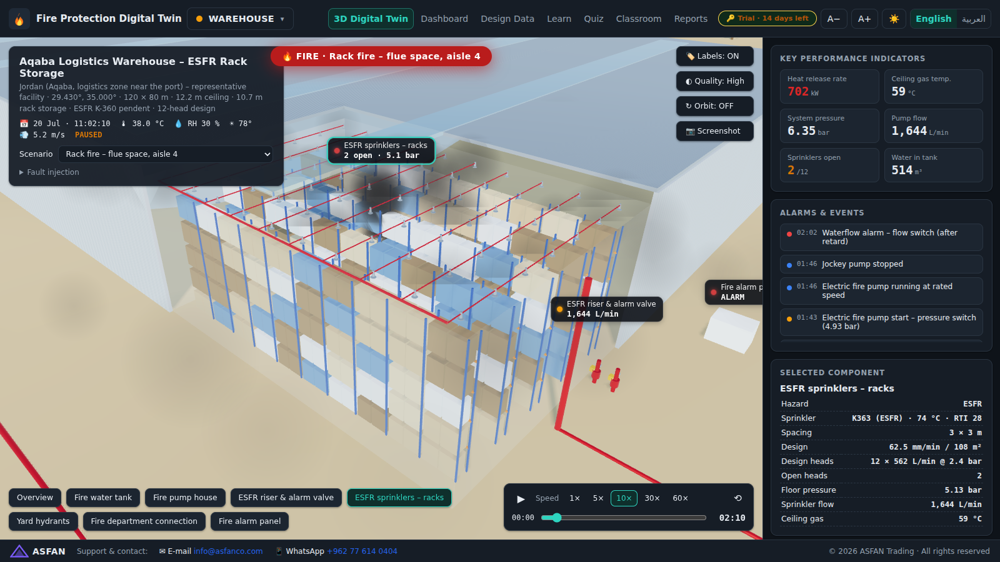
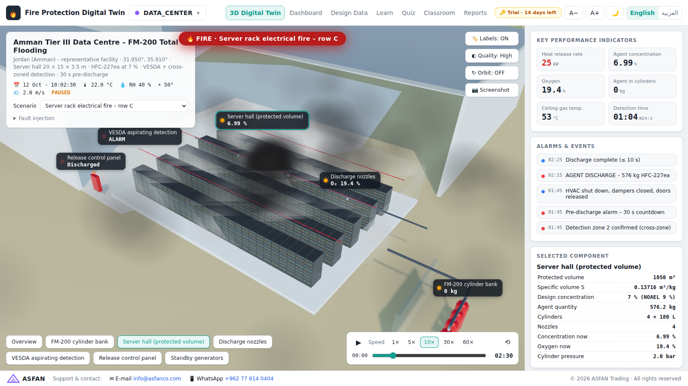
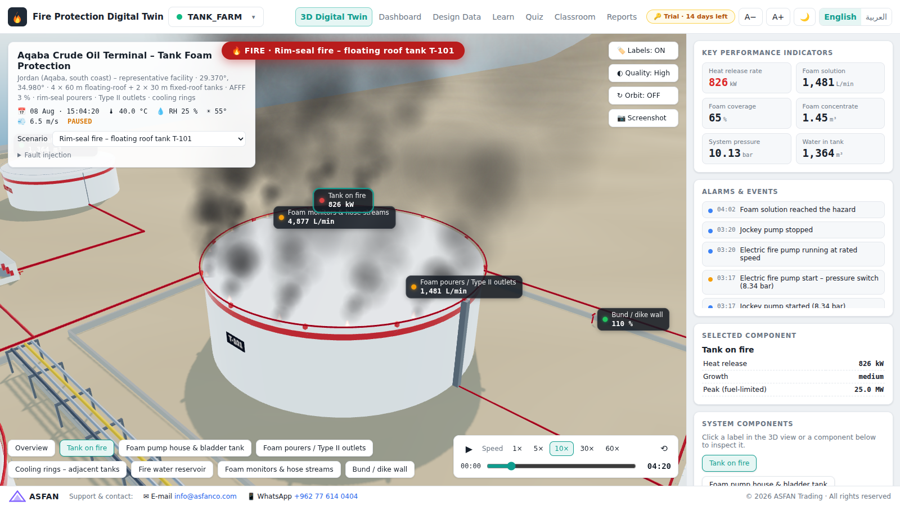
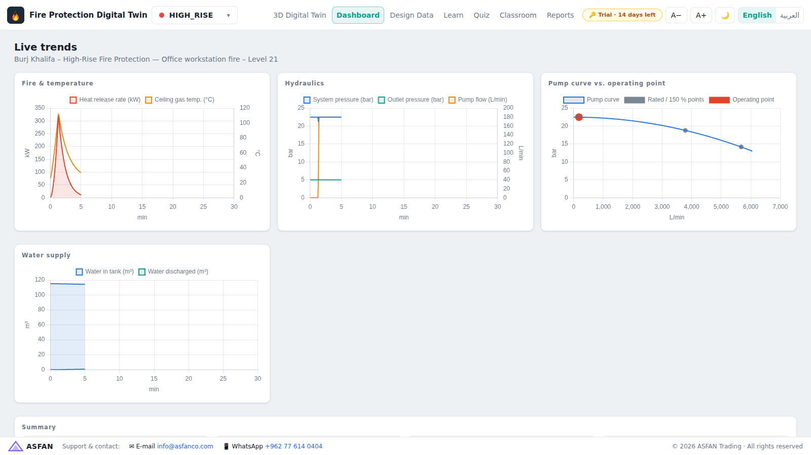
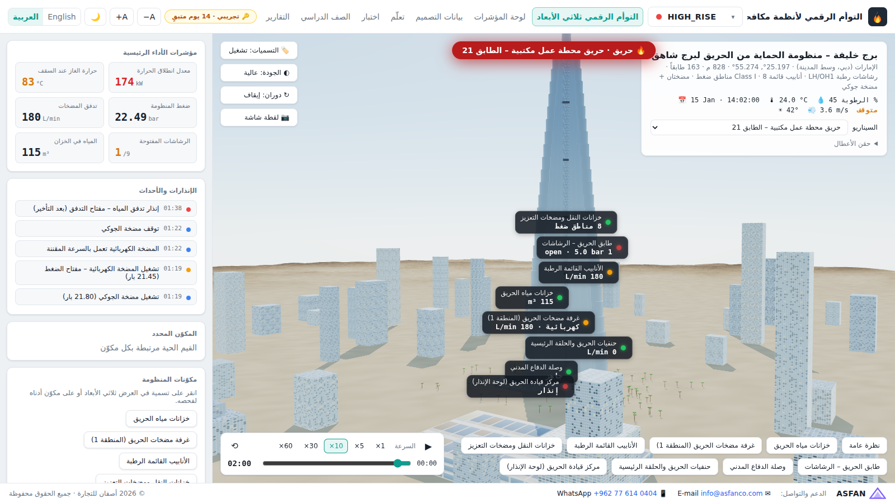

# Fire Protection Digital Twin — التوأم الرقمي لأنظمة مكافحة الحريق

An educational, real-time **3D digital-twin simulator of fire-fighting systems** for universities, training centres and engineering companies. Windows desktop app (`.exe`) with **monthly / annual subscription licensing**, full **English / Arabic (RTL)** interface, light & dark themes.

محاكي تعليمي ثلاثي الأبعاد في الزمن الحقيقي لأنظمة مكافحة الحريق، موجّه للجامعات ومراكز التدريب والشركات الهندسية. تطبيق ويندوز (exe) بترخيص اشتراك **شهري أو سنوي**، وواجهة كاملة **بالعربية والإنجليزية**.



**Realism:** photographed sky with real clouds (HDRI image-based lighting and reflections), CC0 PBR ground and asphalt textures, and Burj Khalifa built on its true Y-shaped plan with 27 spiralling setbacks and the spire to 828 m. Downtown Dubai is placed from real coordinates: Burj Lake and the Dubai Fountain, Dubai Mall, Souk Al Bahar, Old Town, Sheikh Zayed Road, Business Bay, the canal and the Gulf coast. All art assets are CC0 (free for commercial use, see `src/assets/CREDITS.md`).



## Facilities (real sites · NFPA reference designs)

| ID | Site | System simulated |
|---|---|---|
| `HIGH_RISE` | **Burj Khalifa**, Dubai (25.197°, 55.274°) — 828 m, 163 floors | Wet sprinklers (LH / OH1), Class I standpipes, 8 pressure zones, floor PRVs, electric + diesel + jockey pumps |
| `WAREHOUSE` | Logistics warehouse, **Aqaba** (representative) | ESFR K-360 rack storage, 12-head design |
| `DATA_CENTER` | Tier III data centre, **Amman** (representative) | FM-200 (HFC-227ea) total flooding, VESDA, cross-zoned release |
| `TANK_FARM` | Crude oil terminal, **Aqaba south coast** (representative) | AFFF 3 % rim-seal pourers, Type II outlets, cooling rings, monitors |
| `HANGAR` | MRO hangar, **Queen Alia International Airport** (representative) | Foam-water deluge (NFPA 409), UV/IR flame detection, low-level monitors |
| `CUSTOM` | **Create facility manually** — any city, occupancy, floors, K-factor, temperature rating | Auto-designed sprinkler + standpipe + pump system |

Site names, coordinates and building facts are public data. **The fire-protection systems are reference designs prepared with NFPA methods for teaching** — they are not the as-built systems of those sites (the app shows a "REFERENCE DESIGN" badge).

## What the simulator does

* **Engineering calculations (Design Data page)** — NFPA 13 density/area, K-factor `Q = K√P`, Hazen–Williams friction, static head, hose allowance, tank sizing, NFPA 14 standpipe demand, NFPA 20 pump selection (churn ≤ 140 %, ≥ 65 % at 150 % flow, jockey/electric/diesel set-points), NFPA 2001 `W = (V/S)·C/(100−C)`, NFPA 11 foam rates & concentrate. SI and US units side by side.
* **Physics simulation** — t² fire growth, Alpert ceiling-jet correlations, RTI sprinkler-bulb heating, smoke/heat detector response, Evans suppression model, pump curves and system compliance, pressure-switch sequencing, water-tank depletion, clean-agent concentration & hold time, foam blanket coverage, fire-service arrival.
* **Fault injection** — power failure (diesel takes over), closed control valve, jockey failure, leak (short-cycling), low tank, detector failure, abort switch, door held open.
* **3D twin** — live labels on each component, click to inspect, x-ray view inside buildings, fire / smoke / water spray / agent fog / foam effects, fire trucks on arrival, playback 1×–60× with timeline scrubbing, screenshots.
* **Training (interactive 3D scenes)** — nine hands-on scenes built from the course videos, each with an *Explore* mode (click any component) and scored step-by-step procedures on live physics (time ×1/×5/×10, results saved to the Classroom):
  1. Fire pump room walk-through & NFPA 20 start sequence (jockey → electric → diesel on power failure, manual stop)
  2. Annual fire pump flow test (churn / 100 % / 150 %, acceptance curve, pass/fail)
  3. Dry-pipe valve full trip test (timed water delivery vs. 50 s limit, accelerator on/off) and 9-step reset
  4. Floor control valve assembly: waterflow alarm test (retard, 90 s rule) and tamper/supervisory test
  5. Portable extinguishers: placement design with live 22.9 m travel-distance coverage map (NFPA 10) and a P-A-S-S fire-fighting game
  6. Hose drill: fire hose cabinet, 65 mm landing valve, coupling tug test, two-person team, slow valve opening
  7. Sprinkler types (pendent, upright, sidewall, concealed, recessed, ESFR, open) and a response race of six bulbs (rating & RTI) under a t² fire
  8. Stairwell pressurization (NFPA 92): ΔP ≥ 12.5 Pa, door-opening force ≤ 133 N, relief damper, open-door velocity, smoke ingress; Q = 0.839·A·√ΔP
  9. FM-200 room: live NFPA 2001 calculator (SI/IP, NOAEL/LOAEL warnings) and the cross-zoned discharge sequence with abort, 10 s discharge and hold
* **Smart Lab (advanced) — المختبر الذكي** — ten modules for engineers of smart (addressable) fire-alarm & life-safety systems, all driven by one live engine (`src/advanced/system.js`) so a fault planted in one module appears everywhere:
  1. **Addressable panel lab** — realistic FACP faceplate (LCD, LEDs, ACK / SILENCE / RESET / DRILL, access-level key, buzzer), 3-storey building plans with the SLC loop and NAC wiring, field test of every device, cut / short / earth faults, Class A vs B, isolators, auto-learn & addressing, alarm verification, guided exercises and a hidden-fault inspector challenge; device install & wiring encyclopedia.
  2. **Cause & effect matrix** — program inputs × outputs with 30 s delays, graded against NFPA 72 / 90A / 92 / 101 / 2001, and run fire scenarios on a live building section (voice evac, AHU, dampers, stair fans, lift recall, door holders, access control, FM-200, Civil Defense, BMS).
  3. **BMS & integration** — SCADA-style BMS graphics, BACnet objects & Modbus registers with live traffic, firefighter lift Phase I / II, phased voice-evacuation console, monitoring-centre receiver with Contact-ID decoding.
  4. **Installation mode (3D)** — place detectors and sprinklers on a real ceiling with beams, diffusers and ducts; spacing / obstruction rules checked live.
  5. **Commissioning** — pre-functional checks, device-by-device functional test, audibility, battery & hydrostatic tests, printable NFPA 72 Record of Completion.
  6. **Predictive maintenance** — fleet health, trend forecasts, NFPA 72 / 25 ITM schedule and work orders.
  7. **Incident commander** — timed decisions in cascading-failure fires with a replay debrief.
  8. **Modern technologies** — VESDA, beam, UV/IR flame, linear heat, water mist, pre-action interlocks.
  9. **Engineering tools** — hydraulic calculation with supply/demand graph, battery, NAC voltage drop, loop loading, auto-generated riser diagram.
  10. **Learning paths & certificates** — Technician / Engineer / Supervisor / Designer paths, final exam, printable certificates with an offline verification code, instructor heat-map dashboard.
* **Design Data editor** — change any design value (hazard, K, spacing, RTI, pipes, elevation, PRV, fire, pump, tank, FM-200, foam), see NFPA compliance checks and run the simulation on your own data.
* **Dashboard** — live trends, pump curve with moving operating point.
* **Learn** — 11 bilingual lessons (fire basics, sprinklers, hazard classes, pipe schedule, hydraulics, fire pumps, standpipes, detection & alarm, FM-200, foam, NFPA 25).
* **Quiz** — 45 bilingual questions incl. calculations. **Classroom** — hidden-fault troubleshooting challenges, student results, CSV export. **Reports** — PDF simulation report.

| | |
|---|---|
|  |  |
|  |  |
|  |  |

## Build & run

```bash
npm install
npm start            # run in development
npm test             # engineering / simulation tests
npm run dist:win     # Windows installer + portable .exe → release/
```

Pushing to GitHub runs `.github/workflows/build-windows.yml` on a Windows runner, which produces
`FireProtectionDigitalTwin-Setup-<ver>.exe` (installer) and `FireProtectionDigitalTwin-Portable-<ver>.exe`
as build artifacts; pushing a tag like `v1.0.0` also attaches them to a GitHub Release.

## Licensing (monthly / annual subscriptions) — الترخيص

* New installs run a **14-day trial** (all features). Afterwards the app is locked until a license key is activated (🔑 badge → paste the key or load the `.lic` file).
* Keys are **ECDSA P-256 / SHA-256** signed (`FTW1-<payload>.<signature>`), verified offline with the public key embedded in the app — they cannot be forged or edited. System-clock roll-back is detected.
* A key can carry: customer & organisation, **yearly / monthly / custom expiry** (or an internal staff key without expiry), seats, **binding to one computer** (Machine ID), the **facilities included** (others appear 🔒), whether the **training scenes** are included, and the **supervisor (teacher) role** (sees/exports/clears all students' results in the Classroom).

**Issuing keys — easiest:** open `tools/license-generator.html` in Chrome/Edge (works offline), load `keys/private.jwk.json`, fill in the customer, click *Generate*, then copy the key or download the `.lic` file for the customer. The page keeps a local ledger of issued keys (CSV export).

Command line alternative:
```bash
npm run license:issue -- --name "University of Jordan" --org "Fire Eng. Lab" --plan yearly --seats 30 --supervisor --machine ABCD-1234-EF56-7890
npm run license:issue -- --name "ACME" --plan monthly --facilities HIGH_RISE,WAREHOUSE --no-training
npm run license:init -- --force   # new key pair (old keys stop working; rebuild the app)
```
**Never commit or share `keys/private.jwk.json`** (`keys/` is git-ignored).

## Project layout

```
electron/        main process, preload, license verification
src/engine/      design.js (NFPA calculations) · sim.js (physics simulator)
src/scene/       world.js (renderer, sky, terrain, labels) · kit.js (models & effects) · sites.js (facilities)
src/data/        facilities, lessons (EN/AR), quiz (EN/AR)
src/ui/          metrics, pages, license UI
src/advanced/    Smart Lab: system.js (FACP / loop / C&E engine), building.js, one file per module, css/
tools/           build.mjs, license-tool.mjs
tests/           engine + Smart Lab tests (node --test)
```

Support: info@asfanco.com · WhatsApp +962 77 614 0404 — © 2026 ASFAN Trading
